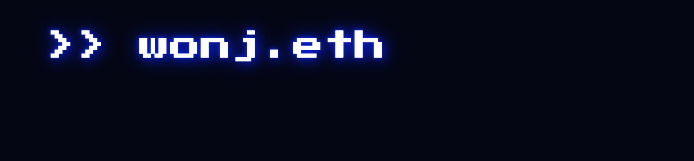

[](https://wonj.me)

# wonj.eth

This repository contains source code of the my website. To view the website, visit [wonj.me](https://wonj.me).

[](LICENSE)

[](https://github.com/0xwonj/wonj.eth/tags)
[](https://github.com/0xwonj/wonj.eth/issues)

## Technologies

- [Next.js](https://nextjs.org/) for frontend framework
- [Tailwind CSS](https://tailwindcss.com/) for styling
- [Vercel](https://vercel.com/) for continuous deployment
- [Wagmi](https://wagmi.sh/) for Web3 functionality

## Branches

To ensure efficient workflow and seamless integration with Vercel for automatic deployment, we follow a specific branching strategy:

- [`main`](https://github.com/0xwonj/wonj.eth/tree/main): This is the production branch and is automatically deployed to Vercel. It contains the latest stable version of the website.

- [`develop`](https://github.com/0xwonj/wonj.eth/tree/develop): Our primary development branch. All new features and changes are merged into this branch. Once the development is complete, we create a pull request to merge `develop` into `main`.

- `feature/*`: For new features and significant changes, we create feature branches from `develop`. Once development is completed, the feature branch is merged back into `develop`. (Not strictly followed)

## Project Setup

### Prerequisites

Before starting, ensure you have the following installed:

- **[Node.js](https://nodejs.org/)**: JavaScript runtime
- **[npm](https://www.npmjs.com/)**: Package manager for JavaScript
- **[Git](https://git-scm.com/)**: Version control system

### Installation

To set up the project locally, run the following command:

```
$ npm install
```

This installs all the necessary dependencies defined in [`package.json`](package.json).

### Local Development

For local development, start the development server with:

```
$ npm dev run
```

This command serves your project on a local server with hot reloading. You can view the website at `http://localhost:3000`.

### Linting

To ensure code consistency and detect style issues, run:

```
$ npm run prettier
```

This command formats your code according to the rules defined in [`.prettierrc`](.prettierrc).

### Build

To create a production-ready build of the project, use:

```
$ npm run build
```

This script builds the application for production usage.

### Deployment

This website is automatically deployed to [Vercel](https://vercel.com/) upon commits to the `main` branch.

## Project Structure

```bash
.
├── app           # Next.js application
│   ├── api       # API routes
│   └── [pages]   # Pages
├── components    # React components
├── public        # Static files
├── data          # Data files
│   └── [pages]   # Data for pages
├── config        # Configuration javascript files
├── utils         # Utility functions
├── assets        # Assets not used in the website
├── .github       # GitHub workflows
└── [configs]     # Configuration files
```

## License

This project is licensed under the CC BY-SA 4.0 License - see the [LICENSE](LICENSE) file for details.
