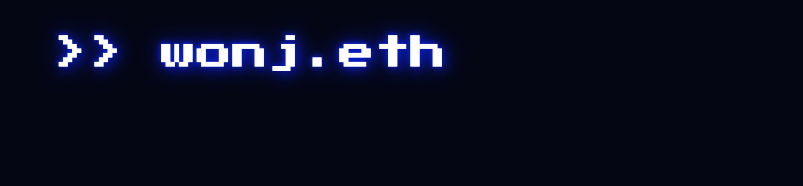

[](https://wonj.me)

# wonj.eth

This repository contains source code of the my website. To view the website, visit [wonj.me](https://wonj.me).


## Project Setup

### Prerequisites

- Node.js
- npm
- Vercel (for deployment)

### Installation

```
$ npm install
```

### Local Development

```
$ npm dev run
```

### Linting

```
$ npm run prettier
```

### Build

```
$ npm run build
```

### Deployment

This website is deployed on [Vercel](https://vercel.com). The deployment is done automatically when the code is pushed to the `main` branch.

## Project Structure

```bash
.
├── app           # Next.js application
│   ├── api       # API routes
│   └── [pages]   # Pages
├── components    # React components
├── docs          # Markdown files for Academia
├── posts         # Markdown files for Blog
├── public        # Static files
├── assets        # Assets for github README
└── [config]      # Configuration files
```
