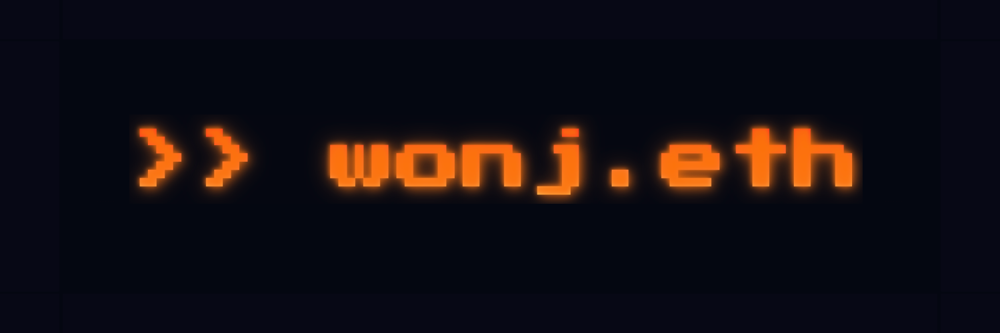

[](https://wonj.me)

# wonj.eth

This repository contains source code of the my website. To view the website, visit [wonj.me](https://wonj.me).


## Technologies

- **Next.js** for server-side rendering
- **Tailwind CSS** for styling
- **Vercel** for continuous deployment
- **Wagmi** for Web3 functionality

## Branches

To ensure efficient workflow and seamless integration with Vercel for automatic deployment, we follow a specific branching strategy:

- `main`: This is the production branch and is automatically deployed to Vercel. It contains the latest stable version of the website.

- `develop`: Our primary development branch. All new features and changes are merged into this branch. Once the development is complete, we create a pull request to merge `develop` into `main`.

- `feature/*`: For new features and significant changes, we create feature branches from `develop`. Once development is completed, the feature branch is merged back into `develop`. (Currently not in use)

## Project Setup

### Prerequisites

- Node.js
- npm
- Vercel (for deployment)

### Installation

```
$ npm install
```

This installs all the necessary dependencies defined in `package.json`.

### Local Development

```
$ npm dev run
```

This command serves your project on a local server with hot reloading. You can view the website at `http://localhost:3000`.

### Linting

To ensure code consistency and detect style issues, run:

```
$ npm run prettier
```

This command formats your code according to the rules defined in `.prettierrc`.

### Build

To create a production-ready build of the project, use:

```
$ npm run build
```

This script builds the application for production usage.

### Deployment

This website is automatically deployed to [Vercel](https://vercel.com/) upon commits to the `main` branch.

## Project Structure

```bash
.
├── app           # Next.js application
│   ├── api       # API routes
│   └── [pages]   # Pages
├── components    # React components
├── public        # Static files
├── posts         # Markdown posts
│   ├── academia  # Academic posts
│   └── blog      # Blog posts
├── assets        # Assets not used in the website
└── [configs]     # Configuration files
```

## License

This project is licensed under the CC BY-SA 4.0 License - see the [LICENSE](LICENSE) file for details.
