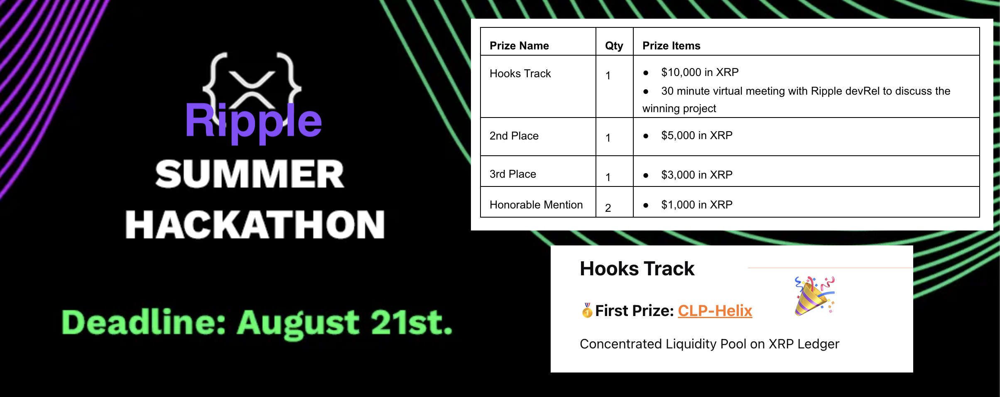

리플 해커톤에서 우승했습니다! 🎉 [결과 링크](https://dorahacks.io/hackathon/xrpl-hackathon/results)

XRPL Swap 팀에서 저를 포함한 2인팀으로 Hooks 트랙에 참가했고, 1등을 했습니다.
프로젝트의 이름은 "CLP-Helix"이고, 주제는 "Concentrated Liquidity Pool"이었습니다.

<!-- truncate -->

## CLP-Helix에 대해

프로젝트는 XRPL Hooks를 이용하여 구현하였고, Uniswap v3의 Concentrated Liquidity Pool을 참고하여 만들었습니다.
Concentrated Liquidity Pool은 Uniswap v3에서 새롭게 나온 개념으로, 특정 가격대에 대해 Liquidity를 제공하는 것입니다.
저희는 계정 하나를 liquidity pool 하나로 사용을 하고, 특정 가격대에 대해 liquidity를 제공하는 것을 구현했습니다.
자세한 내용은 [프로젝트의 README](https://dorahacks.io/buidl/6820)를 참고해주세요.

## 소감

해커톤에 몇번 참가해서 상을 받아봤지만, 이번에 처음으로 우승을 했습니다. 그래서 정말 기쁘고, 이번 기회로 저도 자신감을 많이 얻게 되었습니다.
상금은 10,000 달러인데, 일정 부분은 팀을 위한 자금으로 사용할 예정이고, 나머지는 저와 함께 해커톤에 참가했던 저희 팀의 유상윤님과 나눌 예정입니다.
이번 해커톤을 통해 저희 팀과 저 모두 큰 도약을 할 수 있었고, 앞으로도 더 나아가고 싶습니다!
